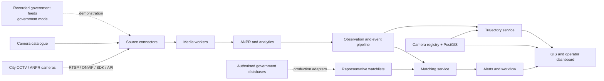
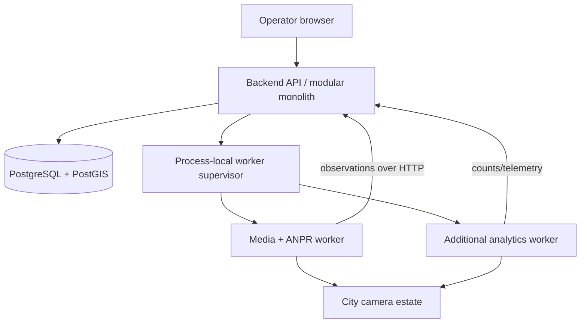
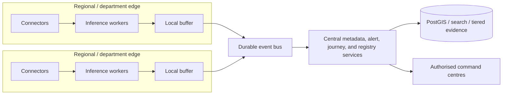

# Architecture

Status: Accepted by [ADR 0001](decisions/0001-integration-shape.md) and [ADR 0002](decisions/0002-implementation-stack.md)

Component-level detail for **SIH26127**. For the system in one document with diagrams, read [hld.md](hld.md) first; this file is the level below it.

The shape is a **camera registry and GIS control plane** plus **direct feed integration** behind adapter contracts, optimised for a small team while preserving a credible evolution path to city-wide deployment.

## Principles

- Build a modular monolith plus independent media workers before creating many network services.
- Separate the control plane, media/analytics plane, and operator experience.
- Keep source video close to the source where possible; centralise metadata, alerts, health, and selectively retained evidence.
- Make every external integration replaceable behind a documented adapter.
- Preserve source PTS and provenance through every derived event.
- Design for degraded links, restarts, mixed codecs, and partial availability.
- Use synthetic data by default and least-privilege access for official resources.

## System context



## Logical components

### 1. Camera registry and GIS control plane

Responsibilities:

- camera node metadata for the whole city estate;
- bulk/manual/API onboarding;
- camera ownership, department, location, type, storage, and connectivity;
- current health and maintenance status;
- GIS layers, search, filters, exports, and gap reports;
- access control and audit.

Accepted implementation: PostgreSQL with PostGIS, a single FastAPI backend, and React Leaflet in the served console. Not every responsibility above is complete; current evidence is tracked per requirement in [requirements.md](requirements.md) under `SIH-PLAT-*`.

### 2. Catalogue and source connectors

The connector boundary converts a source-specific catalogue/stream description into a canonical CameraSource. The first connector targets an HTTP camera catalogue; later connectors can target ONVIF, vendor SDKs, or federation middleware. Government mode is itself a source: it repoints existing camera rows at a local relay serving recorded footage, and nothing downstream can tell the difference.

Connector requirements:

- read-only discovery and health;
- no hard-coded camera IDs;
- current catalogue-provided RTSP, WHEP, and HLS endpoint references;
- redacted diagnostics;
- explicit supported protocols and credentials reference;
- bounded connect/disconnect lifecycle; and
- normalised errors without losing source detail.

### 3. Media workers

Responsibilities:

- RTSP/TCP capture for inference;
- optional HLS/WebRTC paths for viewing;
- H.264/H.265 decode and resolution normalisation;
- PTS extraction and discontinuity detection;
- reconnect/backoff and load pacing;
- frame sampling and backpressure; and
- observation publication.

Transport invariants:

- The feed is live: one second of video takes one second to arrive.
- PTS, not frame-arrival wall time or reported FPS, drives motion and dwell-time calculations.
- Initial buffered GOP replay may arrive faster than real time and must not produce impossible velocities.
- Seeking, complete-file download, byte-range access to a recording, and running ahead are unavailable.
- PTS is monotonic within a stream epoch. Reconnects and loop discontinuities create an explicit new epoch when continuing prior tracker timing would be unsafe.
- Each connected client receives its own stream copy, so capture ownership, concurrency, and bandwidth must be bounded.

Workers must be independently restartable. The current deployment runs them as subprocesses under the backend's process-local supervisor; no durable job queue is implemented. Prefer one owned capture per actively processed camera with internal fan-out to analytics where practical, rather than opening duplicate gateway connections. A city-wide design partitions workers by zone/source and scales horizontally.

### 4. Analytics

The primary path is ANPR (`SIH-OCR-*`). The output is an **Observation, not an alert**. That separation is what allows models to be replaced and results reprocessed without touching watchlist logic, and it is why all four expected components can read the same record without ever disagreeing about what a camera saw.

Only a **confirmed** plate becomes an observation. Per-track voting settles the read first; intermediate OCR output is never published.

An observation includes:

- immutable ID;
- camera and department;
- source PTS and UTC event time;
- stream epoch/discontinuity identity;
- analytic/model/version;
- raw and normalised result;
- confidence and quality flags;
- bounding box/evidence reference when permitted; and
- provenance and processing timestamps.

Additional analytics must publish the same envelope and remain optional.

### 5. Watchlist matching and alerts

Matching normalises plates, applies configured confidence/policy thresholds, and emits a MatchDecision. Alert creation is idempotent and deduplicated over a defined camera/entity/time window.

Keep these distinct:

```text
Observation -> MatchDecision -> Alert -> AlertAction/AuditEvent
```

This preserves explainability and prevents a UI acknowledgement from altering the original analytic result.

### 6. Trajectory reconstruction (`SIH-TRAJ-*`)

Expected component 2. Reconstructs a trajectory from plate observations ordered by **source time** and enriched with registry coordinates, exposing both map and tabular views plus four export formats built from one builder so they cannot disagree.

Quality controls:

- plate normalisation and aliases;
- confidence threshold and low-confidence flagging;
- per-camera/time-window deduplication;
- impossible-time/distance warning;
- stable UTC ordering with source PTS retained; and
- evidence link and model version per point.

Advanced cross-camera re-identification is bonus work after the auditable plate-based journey is stable.

### 7. Operator dashboard

Minimum views:

- camera registry and GIS layers;
- camera health and active preview;
- observations and searchable events;
- live alert queue with acknowledge/resolve workflow;
- vehicle search and route history;
- operational health; and
- export/report action.

Every screen must show degraded/offline/unknown states rather than silently omitting failed data.

## Implemented deployment



Accepted stack; exact package sources are recorded in ADR 0002:

- Python/FastAPI backend and Python media workers;
- OpenCV and FFmpeg/ffprobe for capture and probing;
- YOLO11, ByteTrack, fast-alpr, and ONNX Runtime for the current ANPR baseline;
- PostgreSQL/PostGIS;
- React/Vite with React Leaflet (`frontend-v3` is the served console; `frontend-v2` is retained as reference); and
- process-local worker supervision for the current bounded deployment.

Redis/Kafka, Kubernetes, Docker Compose, and S3-compatible evidence storage are **not** current dependencies. They remain possible scale choices only after measurements and retention requirements justify them.

## City-wide evolution



Scale assumptions must be quantified in the HLD:

- active analytics percentage versus registered cameras;
- average/peak bitrate and resolution distributions;
- frames sampled per analytic;
- streams per CPU/GPU worker;
- metadata and evidence bytes per observation;
- hot/warm/cold retention;
- regional outage buffer duration;
- replication and recovery objectives; and
- operator/search concurrency.

## Security and privacy boundaries

- The identity and access decision is [ADR 0003](decisions/0003-department-rbac.md): `super_admin`, `department_admin`, and `department_user` roles plus per-department `viewer`/`operator` grants.
- The API, not the React UI, enforces the boundary. Camera/media access, observations, alerts, analytics, journeys, reports, and survey frames are filtered or rejected before data is returned.
- Human users authenticate with an opaque HttpOnly session cookie; only a token digest is stored. Worker ingestion uses a separate service token.
- The home department is granted automatically. Only the super admin may add cross-department access; department admins govern employees in their own home department.
- Raw camera endpoints remain in the backend/worker trust zone. Browser clients receive a capability flag and use the authenticated HLS relay.
- Credentials are referenced through environment/secret identifiers, never stored in registry rows or Git.
- TLS protects service and external connections where supported.
- Camera/media networks are isolated from public/operator networks.
- Department and purpose constrain access to streams, observations, watchlists, and alerts.
- Implemented security and state-changing operations append audit events; successful authenticated metadata reads and denied authorisation are audited too. A database trigger rejects application-role audit-row updates/deletes, except the foreign-key actor-reference cleanup on account deletion. A super-admin-only canonical NDJSON archive provides a SHA-256-verifiable external hand-off, but storage in an approved immutable destination remains an explicit `SIH-NFR-002` gap, and a database superuser can still alter database controls.
- Development uses synthetic data or explicitly approved representative material only.
- Evidence retention is selective, configurable, encrypted, and shorter than source video retention unless authorised.
- Biometric or person-identification features require explicit legal/organiser approval and a documented privacy assessment.

## Failure behaviour

| Failure | Expected behaviour |
|---|---|
| Catalogue unavailable | Use last known non-secret metadata for display, stop new discovery, surface stale status. |
| Feed unavailable | Bounded reconnect, health degradation, no busy loop. |
| Decoder join warning | Continue until keyframe/deadline; record diagnostic. |
| Scene discontinuity | Reset unsafe tracker state and retain a discontinuity event. |
| Duplicate capture demand | Reuse the owned active capture where practical or enforce a hard client/concurrency budget. |
| Inference overloaded | Apply sampling/backpressure; never allow unbounded memory growth. |
| Database unavailable | Buffer within a bounded policy or fail visibly; never silently discard alerts. |
| Duplicate observation | Preserve observation as policy allows; deduplicate alert creation idempotently. |
| Dashboard unavailable | Processing continues; operators see service health after recovery. |

## Deliberate non-goals

Stating these is part of the design, not an apology for it. Fuller reasoning in [hld.md](hld.md#7-what-this-design-deliberately-does-not-do).

- **Per-camera speed or heading** - no camera is calibrated and some are PTZ, so only a corridor lower bound is honest;
- **predictive congestion forecasting** - unfalsifiable against a plate-conditioned undercount;
- **face recognition** - out of scope and legally gated; person search returns ranked appearance candidates, never an asserted identity;
- **central video recording** - metadata-first by design, with bounded short-expiry evidence crops only;
- replacing existing VMS products;
- deploying Kubernetes locally; and
- solving every analytics category before OCR, trajectory, and alerting are evidenced.
