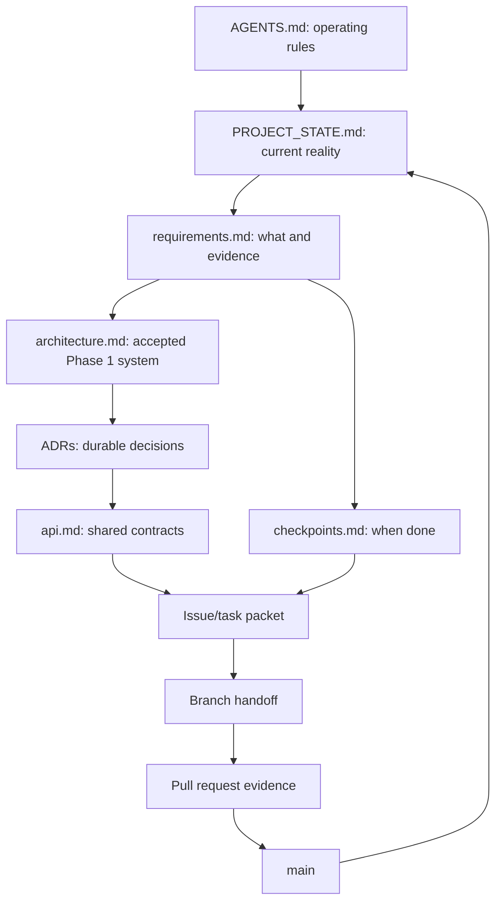

# Cross-Machine and Cross-LLM Context Management

The repository, not a chat session, is the shared memory. Every agent should be disposable: a new person or model on a clean machine must be able to recover the project state from `main` plus the task branch.

## Canonical context map



## Context tiers

Agents should load context progressively:

### Tier 0 - always read

- `AGENTS.md`
- `PROJECT_STATE.md`
- the task/issue

### Tier 1 - read for almost every implementation task

- relevant requirement rows;
- relevant architecture section and ADR;
- affected API/event contracts;
- current checkpoint acceptance criteria.

### Tier 2 - focused implementation context

- directly affected source files;
- their tests;
- dependency manifests and local run instructions.

### Tier 3 - only when needed

- official pages/PDF excerpts;
- historical PRs;
- large logs, screenshots, videos, or generated artifacts.

This prevents different models from receiving huge, inconsistent context dumps while keeping critical rules stable.

## Single agent entry point

- `AGENTS.md` is the only coding-agent instruction file and is provider-neutral.
- Do not add provider-specific instruction files. Configure each tool or bootstrap prompt to read `AGENTS.md` directly.
- A bootstrap prompt should say: “Read AGENTS.md, PROJECT_STATE.md, the assigned task, and only the linked requirement/architecture/API sections before editing.”

A single entry point prevents instruction duplication and drift across providers.

## Machine reproducibility

The first stack PR must establish:

- pinned language/runtime versions;
- committed lockfiles;
- `.env.example` with names and descriptions but no values;
- a single local startup path, preferably containers for infrastructure;
- deterministic migrations and seed data;
- synthetic protocol-compatible fixtures;
- documented CPU/GPU variants; and
- commands that use repository-relative paths.

Do not depend on:

- absolute paths;
- a developer's global packages;
- unversioned model weights;
- private files that are not listed as prerequisites;
- hidden manual database edits; or
- chat-provided secrets.

## Task packet

Every task should be small enough for one branch and should contain:

```text
Task ID:
Objective:
Non-goals:
Requirement IDs:
Checkpoint:
Dependencies/contracts:
Files likely affected:
Acceptance criteria:
Verification commands:
Expected evidence:
Owner:
Reviewer:
```

Use [task-template.md](task-template.md).

## Start-of-work protocol

1. Fetch and inspect the latest `main`.
2. Verify branch and working tree; do not overwrite unrelated local changes.
3. Read Tier 0 and the task's Tier 1 context.
4. Compare the task assumptions with merged contracts.
5. Check existing branches/issues for overlapping ownership.
6. Record any blocking ambiguity before changing a shared schema.

## During work

- Commit code, tests, and documentation together once the human authorises commits.
- Link comments and PR text to stable requirement IDs.
- Put contract decisions in ADRs.
- Keep temporary reasoning out of canonical docs.
- Store only redacted, bounded diagnostic artifacts.
- Rebase/merge `main` frequently enough to expose integration conflicts early.
- When a contract changes, notify all dependent lanes and update the API/ADR in the same PR.

## End-of-session handoff

If work is unfinished, create `docs/handoffs/<task-id>.md` from the template. A good handoff lets a different provider continue without the previous conversation.

Required details:

- branch and base commit;
- last known clean command results;
- files changed and why;
- exact current failure or missing piece;
- next smallest action;
- assumptions and unresolved decisions;
- migration/seed/runtime state to recreate; and
- evidence paths.

Never put passwords, feed credentials, private URLs, access tokens, personal data, or sensitive footage in a handoff.

## Merge-time context consolidation

The PR is where temporary branch context becomes durable:

- Requirement evidence is linked in `requirements.md`.
- Accepted decisions are recorded in ADRs.
- Contracts are updated in `api.md`.
- Milestone reality is updated in `PROJECT_STATE.md`.
- Reproduction commands live in README or component docs.
- The branch handoff can be removed or marked superseded after merge.

`main` should never require reading old chat transcripts to understand why it works.

## Conflict protocol

When agents disagree:

1. Separate official requirement, accepted decision, implementation fact, and preference.
2. Cite the requirement ID and current ADR status.
3. Prefer the option that preserves checkpoint scope and existing contracts.
4. If the choice is hard to reverse or affects multiple lanes, write an ADR and request human/team approval.
5. Never let two branches independently redefine the same schema.

## Context quality checks

At each checkpoint ask a teammate or fresh agent to answer, using the repository only:

- What is the current objective?
- Which requirements are mandatory and still open?
- What architecture has actually been accepted?
- How do I run and test the system?
- What are the shared data/API contracts?
- What failed most recently and what is next?
- Which claims have evidence?

If these cannot be answered quickly, the repository context is incomplete.
