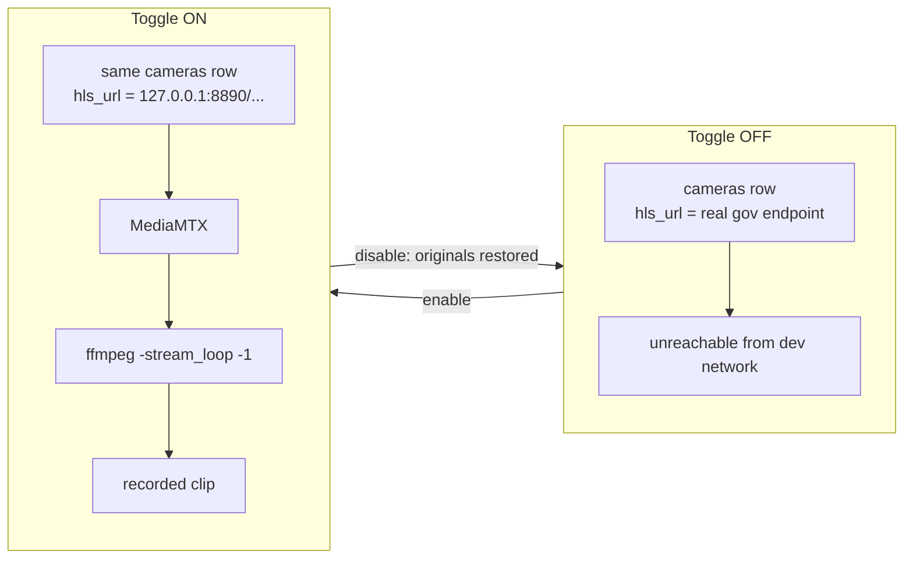

# Demo and government modes

Two super-admin toggles in **Access admin → Advanced** let the full platform be demonstrated without reachable live cameras. Both are designed around one rule:

> **No downstream component may know which mode is on.**

ANPR, trajectory reconstruction, traffic analytics, alerting, and the operator console all run completely unmodified in either mode, because the only thing that changes is what a camera row's stream URL points at. That is what makes a demo defensible — it exercises the real pipeline, not a special-cased demonstration path.

The two modes are **mutually exclusive**; enabling one while the other is active returns `409`.

---

## Government mode

**What it is for:** demonstrating the platform against *real government CCTV footage* when the live endpoints are not reachable from a development network.

### How it works



On enable it:

1. Discovers every completed recording under `recorded-streams/` (a `.mp4` plus a `.json` sidecar naming its `camera_id`).
2. Starts a MediaMTX instance plus one `ffmpeg -stream_loop -1 -re` publisher per clip, serving each as a genuinely continuous RTSP + HLS stream — **real transport, not a seekable file**.
3. Saves each matching camera's original `hls_url` / `rtsp_url` to `recorded-streams/_relay/government_mode_state.json`.
4. Overwrites those two columns with the relay URLs.

On disable it restores the saved originals, stops the relay, and deletes the state file.

It **never creates or deletes a camera row.** These are real, already-onboarded cameras; only two columns change, temporarily.

### Sidecar format

```json
{
  "camera_id": "cam11",
  "recorded_at_utc": "2026-09-10T14:21:56.982561+00:00",
  "bytes": 63998694
}
```

`camera_id` must match a row in the registry, or the clip is skipped and reported as unmatched.

An optional `clip_path` field lets several camera IDs share **one physical recording**:

```json
{
  "camera_id": "cam11b",
  "clip_path": "20260910-1421-15.8829201.mp4",
  "note": "Same source clip as cam11 — onboarded again at a different corridor point."
}
```

This is how a single clip builds a multi-stop journey along a real corridor without duplicating tens of megabytes per stop. The five `cam11`→`cam11e` cameras sit at real, `exact`-geocoded points along Ahmedabad's SG Highway, which is what gives the trajectory and corridor-analytics features genuine geometry to work against.

When several recordings name the same `camera_id`, the sidecar's `recorded_at_utc` picks the most recent — so re-recording a bad take does not require deleting the old file.

### Requirements

- `mediamtx` installed and `MEDIAMTX_BIN` set (see [SETUP.md](../SETUP.md)).
- At least one completed recording under `recorded-streams/`.
- Camera rows whose IDs match the sidecars — `backend/scripts/seed_government_cameras.py` creates them.

### Drift detection

The mode's state lives in a **file**, while the URLs live in the **database**. Anything that writes `cameras.hls_url` outside this module — a direct edit, a seed script, another admin session — can pull a camera out from under an active government mode. The Live wall then filters correctly and plays nothing.

`GET /api/admin/government-mode` therefore reports `degraded: true` when any owned camera no longer points at the relay. **Re-pressing the toggle repairs it**, re-applying the relay URLs and restarting any dead relay processes. The read itself never writes.

---

## Demo mode

**What it is for:** standing up a self-contained rehearsal environment for a screen recording, with no dependency on real footage.

It is the mirror image of government mode:

| | Government mode | Demo mode |
|---|---|---|
| Cameras shown | Only real catalogue cameras | Only cameras this app created (`manual-*`) |
| Creates camera rows | Never | Yes, and removes them on disable |
| Footage | Real recorded government feeds | Looping synthetic fixture |
| Also seeds | — | A watchlist entry and a plate's prior stops |

Demo mode reads its fixture from `fixtures/live-test/` and relays it on its own MediaMTX ports (8557 RTSP / 8888 HLS), distinct from government mode's (8556 / 8890) so both can coexist with the WebRTC preview relay (8554 / 9997).

Turning it off removes everything it created and leaves the rest of the registry untouched.

---

## Live-view behaviour

While either mode is on, the Live view curates its grid — and **only its own grid**:

- Government mode hides `manual-*` cameras, and sorts the cameras actually pointed at a working relay first, so the wall opens on live feeds rather than interleaving them with unreachable ones.
- Demo mode does the opposite, showing only `manual-*` cameras.

The Registry, GIS map, gap analysis, and the status rail's camera count all read the unfiltered registry and keep showing the **real full estate** regardless of mode. The curation is a presentation choice for one screen, never a change to the system of record.

---

## API

| Method | Path | Access |
|---|---|---|
| `GET` | `/api/admin/government-mode` | any authenticated user |
| `POST` | `/api/admin/government-mode/toggle` | super admin |
| `GET` | `/api/admin/demo-mode` | any authenticated user |
| `POST` | `/api/admin/demo-mode/toggle` | super admin |

The reads are deliberately open to any authenticated user so the Live view can check which curation to apply; only the toggles are super-admin gated. Both toggles write an audit event (`government_mode.enabled`, `government_mode.repaired`, `government_mode.disabled`, and the demo-mode equivalents).

---

## Honesty in the demo

Government mode replays **real** government CCTV footage through the real pipeline. That is a genuine demonstration of the ANPR, trajectory, and alerting path.

It is **not** a demonstration of:

- live city-wide deployment at scale,
- ingestion from the government network under production conditions, or
- OCR accuracy — the clips are unlabelled, so they show the pipeline works, not how often it is right.

Say so when presenting. The mode is clearly labelled as active in the Admin panel, and [PROJECT_STATE.md](../PROJECT_STATE.md) records the distinction.
