# High-Level Design — SIH26127

**City-Wide AI Engine for Multi-Camera ANPR Trajectory Tracking and Urban Traffic Analytics**
Bharat Electronics Limited · Smart India Hackathon 2026

This is the technical proposal for `SIH-SUB-003`. It describes what the platform is, how the four expected components fit together, and — explicitly — what it does not do. [architecture.md](architecture.md) carries the component-by-component responsibilities; this document is the level above it.

---

## 1. The problem being solved

A city already owns the cameras. What it does not own is the **linkage between them**.

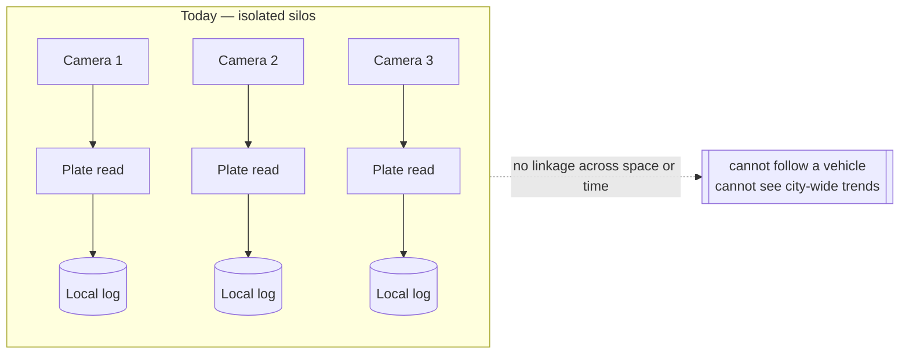

Each feed produces plate reads that die in their own silo. A vehicle crossing three sectors produces three unrelated records. The platform's job is to turn those into **one trajectory** and, in aggregate, into **city-wide movement intelligence**.

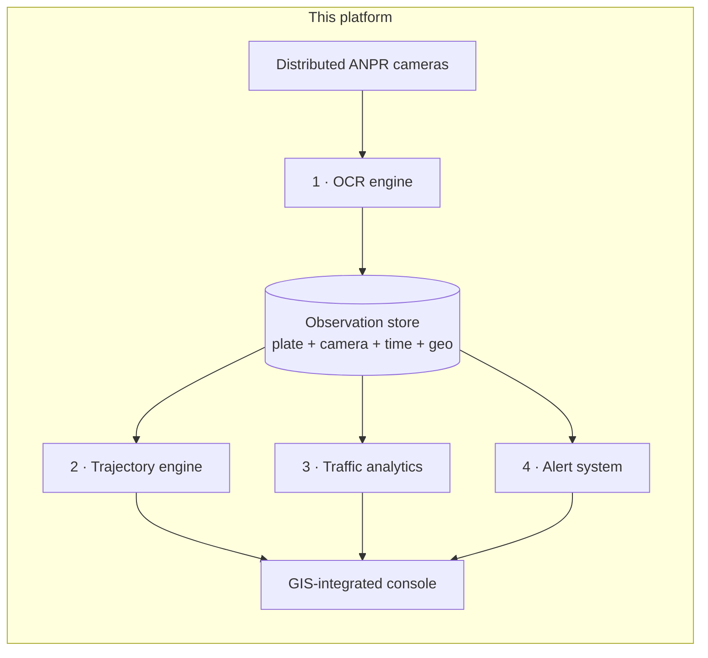

The **observation store is the hinge**. Every one of the four components reads from the same normalised record, which is why they can never disagree about what a camera saw.

---

## 2. System context

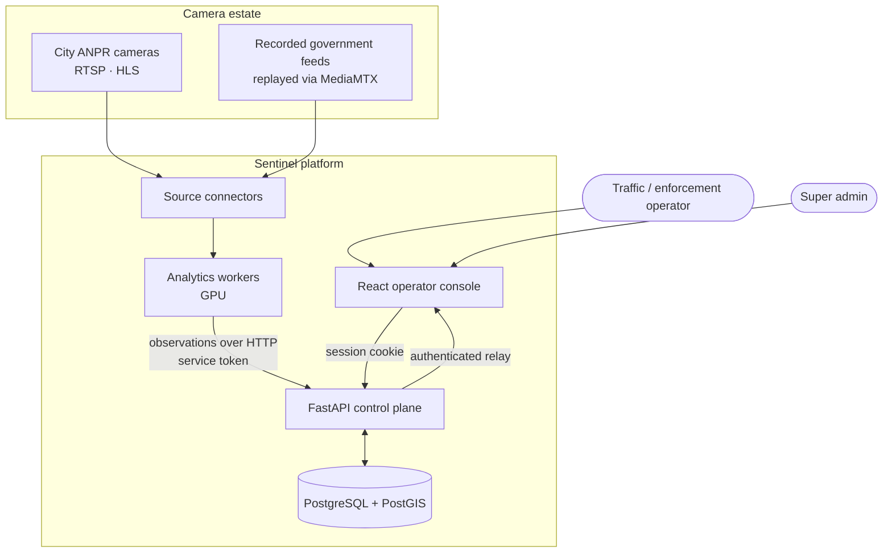

Two properties matter here:

- **Workers never touch the database.** They post observations to the API over HTTP with a service token separate from human sessions. That keeps the schema private to the control plane and lets workers run on other hosts later without a database credential.
- **The browser never receives a raw camera endpoint.** It gets capability flags; media arrives through an authenticated, department-checked relay.

---

## 3. Data flow — a single plate, end to end

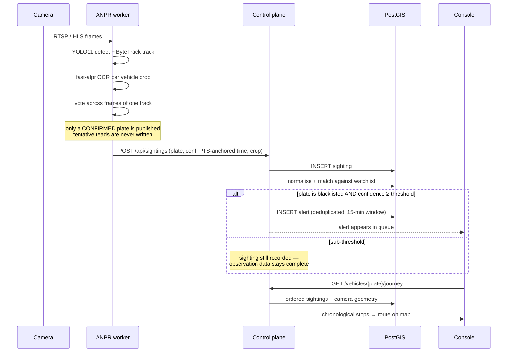

The **confirm-then-publish** rule is deliberate. Publishing every intermediate OCR output would let unvalidated guesses masquerade as settled fact in the registry, and would corrupt both the trajectory and the traffic counts.

---

## 4. The four expected components

### 4.1 Component 1 — High-Precision OCR Module

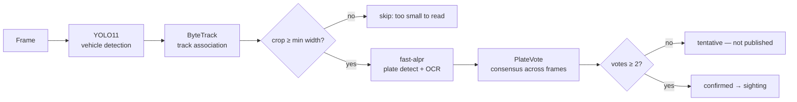

Running on CUDA via ONNX Runtime. A per-vehicle **pre-gate** skips crops too small to read, so GPU time is spent on plates that can actually resolve.

**Status:** works; reads real Indian plates at 0.88–1.00 confidence. The problem statement's **>90 % accuracy target is not yet measured** — that requires ground-truth labelled footage covering lighting, weather, angle, blur, and damaged plates. Until that exists, no accuracy figure is claimed.

### 4.2 Component 2 — Trajectory Reconstruction Engine

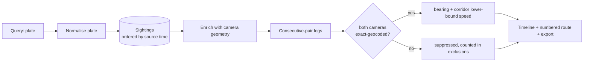

Ordered by **source-anchored time**, never frame-arrival time. A stream that cannot be time-anchored reports `null` and the backend rejects the sighting rather than inventing a timestamp — a fabricated time would silently corrupt every trajectory built on it.

### 4.3 Component 3 — City Traffic Analytics Dashboard

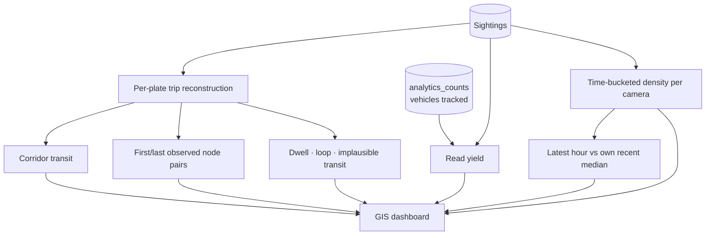

**Read yield is not decoration.** A sighting exists only when a plate was *confirmed*, so raw counts are a floor on real traffic, not a measurement of it. Publishing reads-over-vehicles-tracked alongside every density figure keeps a plate-conditioned undercount from being read as traffic volume.

**Status: unmerged.** Built on `new-implementations`, unit-tested 15/15 without a database, never run against Postgres. The heatmap layer is not built.

### 4.4 Component 4 — Alert System

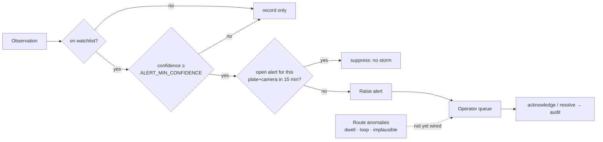

Blacklist alerting is verified end to end. **Route-anomaly alerting is the outstanding gap** — the anomalies are derived on the analytics branch but surface only through traffic endpoints, not the alert queue.

---

## 5. Deployment

### Current — single host, hosted database

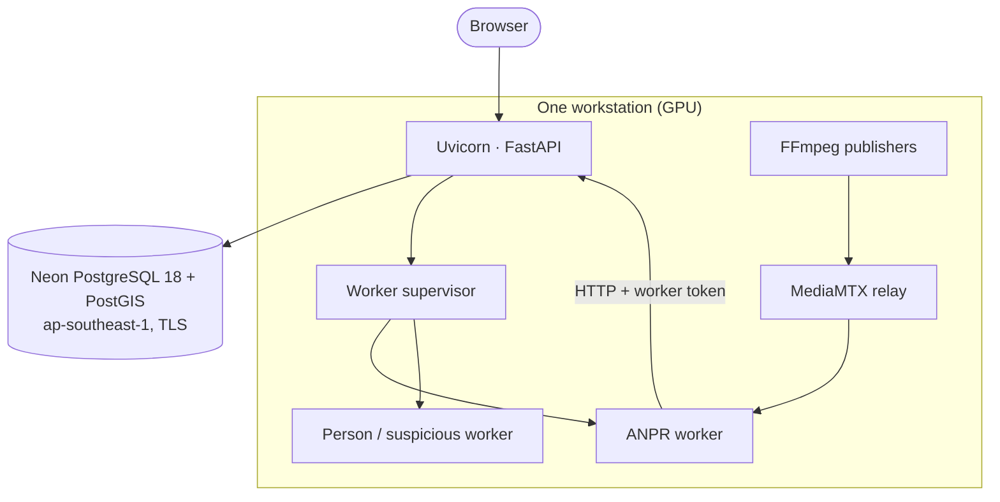

Only the database is remote. **Video never leaves the host** — inference runs against the local GPU, and only derived metadata is persisted.

### Proposed — city scale

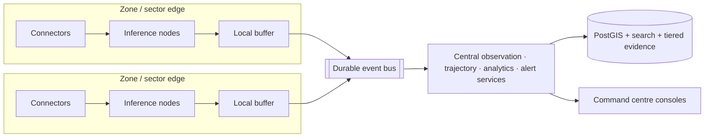

Inference moves to the edge; only metadata crosses the network. This is the **metadata-first** property that makes city scale plausible: a plate read is a few hundred bytes, a video stream is megabits per second.

Quantifying this — streams per GPU, bitrate distribution, retention tiers, bus throughput — is `SIH-PLAT-010` and is **not yet written**.

---

## 6. Demo and government modes

A city-wide platform cannot be demonstrated without a city. Two toggles solve this **without special-casing any downstream logic**:

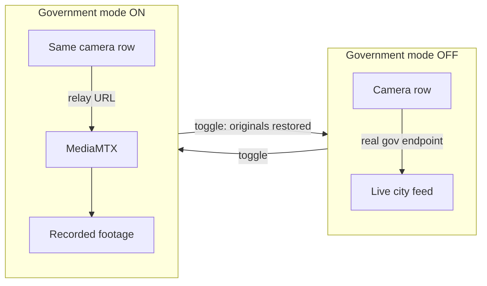

The toggle swaps **two columns** on rows that already exist. ANPR, trajectory, analytics, and alerting cannot tell the difference, because as far as they are concerned it is simply that camera's stream URL. Onboarding, scaling, and registry behaviour are untouched.

Because the mode's state lives in a file while the URLs live in the database, the two can drift. The status endpoint reports `degraded` when they do, and re-pressing the toggle repairs it.

---

## 7. What this design deliberately does not do

Stating these is part of the design, not an apology for it:

| Not done | Why |
|---|---|
| Per-camera speed or heading | No camera is calibrated — no homography, pixels-per-metre, mounting height, or FOV, and some are PTZ. Corridor speed ships as a straight-line **lower bound**, never a speeding finding |
| Predictive congestion forecasting | With a plate-conditioned undercount and limited history it would be unfalsifiable. A labelled baseline comparison ships instead |
| Face recognition | Out of scope and legally gated. Person search returns ranked appearance candidates, never an asserted identity |
| Central video recording | Metadata-first by design; only bounded evidence crops are retained, on a short expiry |
| Claiming >90 % OCR accuracy | Unmeasured. It stays unclaimed until ground truth exists |

---

## 8. Technology

| Layer | Choice | Why |
|---|---|---|
| Backend | Python 3.11 · FastAPI · SQLAlchemy 2 · Alembic | Async I/O suits stream-adjacent work; one language across API and CV workers |
| Database | PostgreSQL + PostGIS | Trajectory and analytics are inherently spatial; avoids a separate spatial service |
| Detection / tracking | YOLO11 + ByteTrack | Strong accuracy-per-FLOP; ByteTrack keeps identity across frames so votes can accumulate |
| OCR | fast-alpr + ONNX Runtime (CUDA) | Purpose-built for plates; ONNX gives GPU execution without a second training stack |
| Media | FFmpeg · MediaMTX | Real transport semantics (RTSP/HLS/WHEP), not seekable files |
| Frontend | React 19 · Vite 8 · React Leaflet | GIS-integrated console is a stated requirement |

Pinned versions: [ADR 0002](decisions/0002-implementation-stack.md), `backend/requirements.txt`, `frontend-v3/package-lock.json`.

---

## 9. Traceability

Every claim above maps to a requirement ID in [requirements.md](requirements.md). Component sections map to `SIH-OCR-*`, `SIH-TRAJ-*`, `SIH-ANLY-*`, `SIH-ALERT-*`; platform and deployment map to `SIH-PLAT-*`; section 5's scale gap is `SIH-PLAT-010`; section 7's limitations are recorded as explicit `In progress`/`Not started` states rather than omitted.
